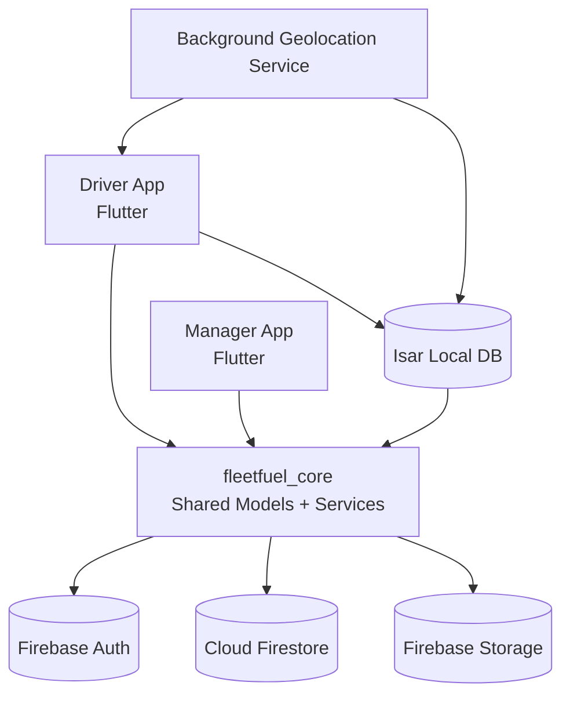

# FleetFuel360

**Fleet & Expense Management System for Commercial Vehicle Operations**


FleetFuel360 is a dual-application mobile platform designed to improve financial accountability and operational visibility in small and medium fleet businesses. The system consists of a driver-facing app for field data capture and a manager-facing app for monitoring, analytics, and financial control, built on a shared Firebase backend and a shared Dart core package.

---

## Table of Contents

- [Abstract](#abstract)
- [Problem Statement](#problem-statement)
- [System Design Overview](#system-design-overview)
- [Core Functional Scope (Current Build)](#core-functional-scope-current-build)
- [Technology Stack and Rationale](#technology-stack-and-rationale)
- [Repository Structure](#repository-structure)
- [Data Model Snapshot (Firestore)](#data-model-snapshot-firestore)
- [Key Business Logic](#key-business-logic)
- [Security and Data Access Notes](#security-and-data-access-notes)
- [Current Build Status (Important)](#current-build-status-important)
- [Build and Run](#build-and-run)
- [Reproducibility Checklist (Recommended for Review)](#reproducibility-checklist-recommended-for-review)
- [Known Limitations](#known-limitations)
- [Roadmap](#roadmap)
- [Academic/Review Positioning](#academicreview-positioning)
- [Project Links](#project-links)

---

## Abstract

Many fleet operators still rely on fragmented reporting channels (paper receipts, messaging apps, verbal reporting), which weakens expense traceability and delays reconciliation. FleetFuel360 addresses this gap through a structured, offline-first workflow for logging expenses and tracking fleet movement, while enabling managers to review live status, analyze cost patterns, and record reimbursements.

This repository contains the full implementation in a monorepo architecture:

- `apps/driver_app`: Driver workflow, background tracking, offline log capture and sync.
- `apps/manager_app`: Fleet monitoring, finance views, analytics, and operational controls.
- `packages/fleetfuel_core`: Shared models, services, sync logic, and utilities.

---

## Problem Statement

Fleet businesses commonly face four recurring issues:

1. **Expense ambiguity**: no standardized capture of fuel and cash spending.
2. **Delayed settlement**: reimbursement is often reconciled late and manually.
3. **Low traceability**: weak linkage between logs, location, and driver/vehicle identity.
4. **Limited live visibility**: managers cannot quickly evaluate daily fleet status.

FleetFuel360 is designed as a practical, implementation-first response to these constraints.

---

## System Design Overview

### High-Level Architecture



### Design Principles

- **Offline-first capture path**: logs and location pings persist locally before cloud sync.
- **Single source of business logic**: shared `fleetfuel_core` package reduces cross-app drift.
- **Role-separated UX**: purpose-built app per actor (driver vs manager), not role-toggling screens.
- **Cloud-backed consistency**: real-time Firestore listeners maintain near-live manager visibility.
- **Progressive enhancement**: future automation (OCR, notifications) is scaffolded without blocking core flows.

---

## Core Functional Scope (Current Build)

### Driver Application (`apps/driver_app`)

- Email/Password authentication (Firebase Auth)
- KYC onboarding (profile + license capture)
- Company join via 6-character company code
- 4-step log creation flow:
  - log type selection
  - media capture/compression
  - details entry
  - review + submit
- Supported log types:
  - fuel fill
  - cash expense
  - payment received
  - advance
  - loan
  - other
- Background GPS tracking (heartbeat + movement-based updates)
- Offline queue (Isar) with sync retry pipeline
- Driver ledger and log history

### Manager Application (`apps/manager_app`)

- Email/Password authentication (Firebase Auth)
- Company setup and code generation
- Dashboard with status cards + mini live map
- Live map with custom markers and selectable trails
- Fleet module (vehicles/drivers views)
- Driver detail and vehicle detail screens
- Finance module:
  - filterable company logs
  - per-driver ledger summary
  - manager-recorded payment entries

### Shared Core (`packages/fleetfuel_core`)

- Data models (users, companies, vehicles, assignments, logs, location pings)
- Firestore service layer (query and mutation APIs)
- Storage upload abstraction
- Sync service and local-to-cloud mapping logic
- Utility layer (formatting, validators, constants, geohash)

---

## Technology Stack and Rationale

| Layer | Technology | Rationale |
|---|---|---|
| UI Framework | Flutter (Dart) | Single codebase with high UI consistency and strong Firebase ecosystem |
| Authentication | Firebase Auth | Managed identity and session management |
| Structured Data | Cloud Firestore | Real-time listeners and flexible document model |
| Media Storage | Firebase Storage | Receipt/license/vehicle image persistence |
| Offline Persistence | Isar | Fast embedded local database for queueing logs and pings |
| State Management | Riverpod | Explicit, test-friendly dependency and state graph |
| Routing | GoRouter | Declarative navigation with auth/onboarding guards |
| Mapping | google_maps_flutter | Native map rendering and marker/polyline support |
| Background Tracking | flutter_background_geolocation | Foreground service + headless handling for Android |

---

## Repository Structure

```text
FleetFuel360/
├── apps/
│   ├── driver_app/
│   │   ├── lib/
│   │   │   ├── features/
│   │   │   ├── core/
│   │   │   └── main.dart
│   │   └── pubspec.yaml
│   └── manager_app/
│       ├── lib/
│       │   ├── features/
│       │   ├── core/
│       │   └── main.dart
│       └── pubspec.yaml
├── packages/
│   └── fleetfuel_core/
│       ├── lib/
│       │   ├── models/
│       │   ├── services/
│       │   └── utils/
│       └── pubspec.yaml
├── firebase/
│   ├── firestore.rules
│   ├── storage.rules
│   ├── firestore.indexes.json
│   └── functions/
└── README.md
```

---

## Data Model Snapshot (Firestore)

| Collection | Purpose |
|---|---|
| `companies` | Company identity, code, manager linkage, member references |
| `users` | Driver/manager profiles, KYC state, last known location |
| `vehicles` | Vehicle metadata and current assignment pointers |
| `vehicleAssignments` | Assignment timeline and active assignment state |
| `logs` | Financial logs (fuel/expense/payment/advance/loan/other) |
| `locationPings` | Driver geolocation telemetry with timestamps |

---

## Key Business Logic

### Fuel Efficiency

Fuel efficiency is computed using odometer delta between sequential fuel logs divided by dispensed litres.

```text
km_per_litre = (later.odometer - earlier.odometer) / later.fuelQuantityLitres
```

### Driver Balance

Positive balance indicates company owes driver.

```text
balance += driver-paid cash expenses and fuel fills
balance -= payment_received and advance entries
```

### Sync Lifecycle

```text
PENDING -> UPLOADING -> SYNCED
        -> PENDING (retry)
        -> FAILED (after max attempts)
```

---

## Security and Data Access Notes

- Firestore access control is company-scoped through security rules + scoped queries.
- Driver and manager roles are separated in app routing and data flows.
- Cloud Functions currently include stubs for future automation.
- Storage rules are currently authenticated-user scoped and can be hardened further in a dedicated security pass.

---

## Current Build Status (Important)

- **Active auth path**: Firebase Email/Password.
- **Google Sign-In**: present as planned/future placeholder in UI.
- **FCM notifications**: scaffolded in architecture, not fully active in current runtime behavior.
- **Automated tests**: currently limited; primary validation has been manual device-based testing.

---

## Build and Run

### Prerequisites

- Flutter (stable)
- Dart (bundled with Flutter)
- Firebase CLI
- Android Studio / Xcode
- Valid Firebase config files for both apps

### 1) Install dependencies

```bash
cd packages/fleetfuel_core && flutter pub get
cd ../../apps/driver_app && flutter pub get
cd ../manager_app && flutter pub get
```

### 2) Run code generation

```bash
cd packages/fleetfuel_core && dart run build_runner build --delete-conflicting-outputs
cd ../../apps/driver_app && dart run build_runner build --delete-conflicting-outputs
cd ../manager_app && dart run build_runner build --delete-conflicting-outputs
```

### 3) Run applications

```bash
cd apps/driver_app && flutter run
cd ../manager_app && flutter run
```

### 4) Firebase deployment (rules/indexes/functions)

```bash
firebase deploy --only firestore:rules
firebase deploy --only firestore:indexes
firebase deploy --only storage
```

---

## Reproducibility Checklist (Recommended for Review)

For academic/demo validation, record these values in release notes or report appendix:

- Monorepo commit hash
- `flutter --version` output
- App build number/version for each app
- Firebase project ID used during evaluation

---

## Known Limitations

- Odometer reliability still depends on manual driver input.
- Background behavior may vary on aggressively optimized Android OEM builds.
- Storage rules require a stricter least-privilege hardening pass.
- Automated test coverage is currently lighter than desired for long-term maintenance.

---

## Roadmap

- Google Sign-In activation
- FCM-based manager-to-driver notifications
- OCR-based extraction for odometer/receipt assistance
- Additional automated test suites (unit + integration)
- Security hardening for storage access policies

---

## Academic/Review Positioning

This repository is intentionally structured to support technical review in academic settings:

- explicit module boundaries
- shared-domain model consistency
- implementation-aligned architecture
- clear separation of delivered capabilities vs future work
- reproducible setup and deployment path

---

## Project Links

- Current monorepo: `https://github.com/sah1lga1kwad/FleetFuel360`
- Legacy driver prototype: `https://github.com/sah1lga1kwad/fleetfuel360_driver`
- Legacy manager prototype: `https://github.com/sah1lga1kwad/fleetfuel360_manager`
- Demo folder: `https://drive.google.com/drive/folders/1cDmYaCV1kARmYMDpAeneEPiLlY7iUTWc?usp=sharing`
